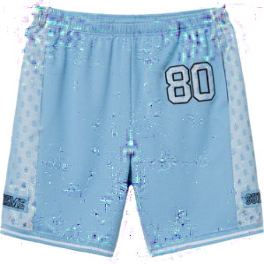

# Attack

## Requirements

- Python3
- Pytorch 1.0
- tqdm
- Numpy
- torchvision
- sklearn
- tensorboardX
- pretrainedmodels

## Non Targeted Attack  
- gradient_based_attack.py  

## Targeted Attack

- Not Supported Now

## 目录结构
```
+-- models  
|   +-- tf_to_pytorch_inception_v1.pth  
|   +-- tf_to_pytorch_inception_v1.py  
|  
+-- data  
|   +-- IJCAI_2019_AAAC_train  
|      +-- 00000  
|         +-- xxx.jpg  
|   +-- dev_data  
|      +-- xxx.png  
|      +-- dev.csv  
+-- dataset  
|   +-- image_from_json.py  
|   +-- image_list_folder.py  
+-- train.py  
+-- config.py  
```
## Results

  
  

## ToDo  

- add algorithm explanation  